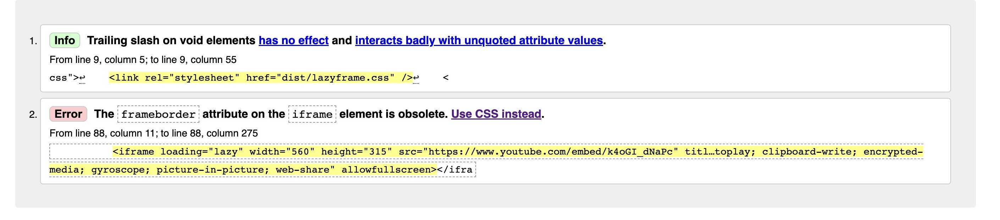
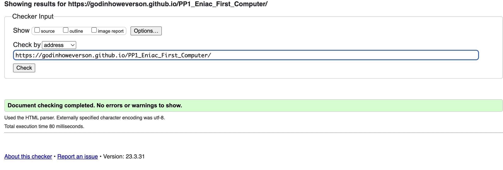
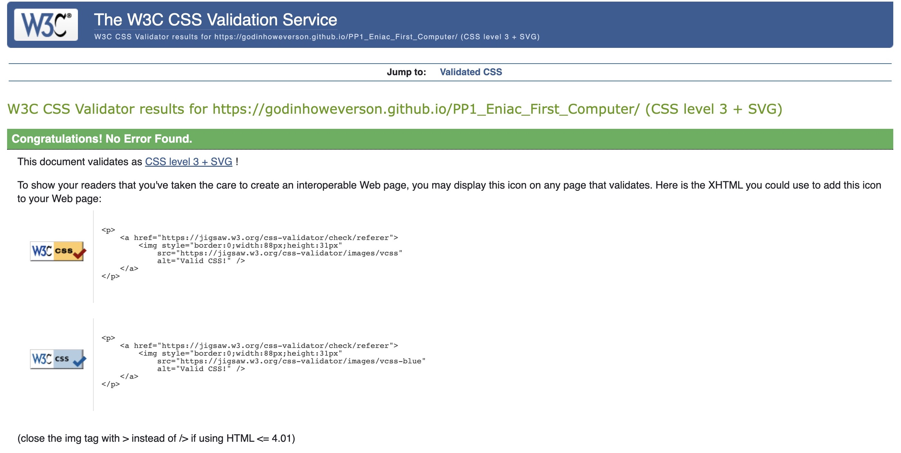
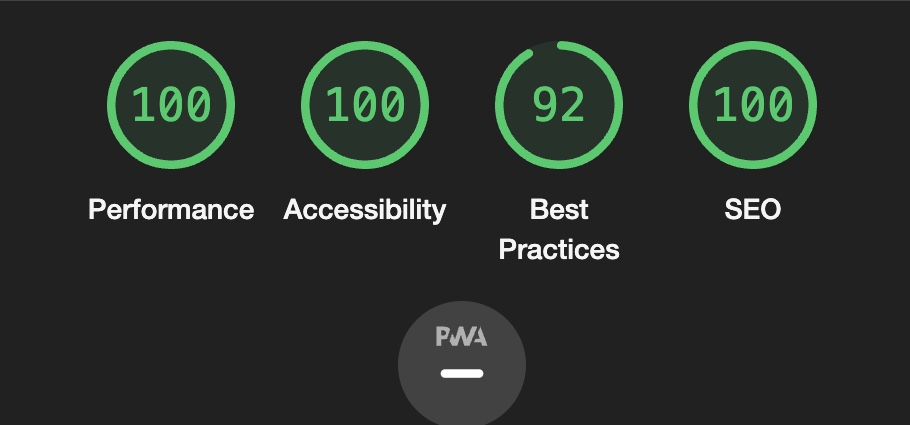
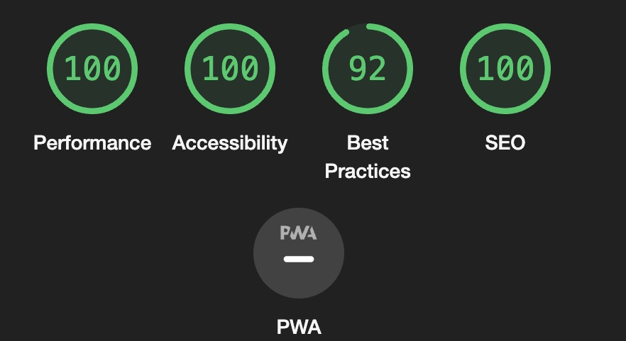
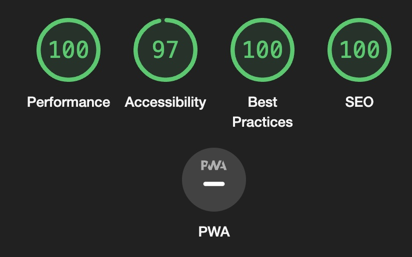
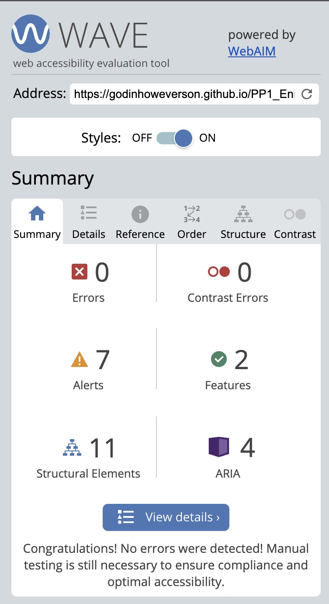

### Testing

- I tested that this page works in different browsers: Chorme, Firefox, Safari.

## W3C HTML Validator

- HTML
   - I have used <a href="https://validator.w3.org/" target="_blank">HTML W3C Validator.</a>
   - Error: The frameborder attribute on the iframe element is obsolete.

   - Solved error: I used style="border:0;" instead of frameborder.
   

- Css
  - I have used <a href="https://jigsaw.w3.org/css-validator/" target="_blank">CSS Jigsaw Validator.</a>
  - No error.

  

  ### Lighthouse

  ## Desktop

  - Home Page

    

  - About Page

    
  
  - Sign Up Page
  
    

### Accessibility
   - I have used <a href="https://wave.webaim.org/" target="_blank">Wave.</a>
   - All pages tested no error found.

   